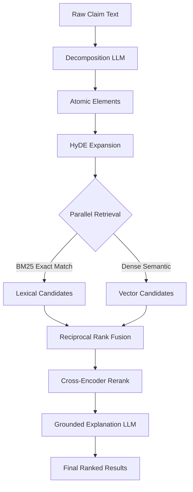

# Patent Prior-Art Search Engine

A hybrid-retrieval, reranked, and explainable prior-art discovery system. This system decomposes raw patent claims into atomic technical limitations, expands them using HyDE (Hypothetical Document Embeddings), and performs a parallel hybrid search (BM25 + Dense) across a bounded patent corpus. The results are then fused using Reciprocal Rank Fusion (RRF), reordered by a cross-encoder reranker, and accompanied by grounded explanations.



## The Forcing Function

Pure dense retrieval silently drops exact patent-number and chemical-formula matches. Pure BM25 misses semantic paraphrase of the same technical concept. A missed invalidating document is a flawed legal opinion with real liability. Every retrieval layer in this system must earn its place with a measured precision/recall improvement.

### Worked Examples (from Evaluation)

1. **BM25 Failure Caught by Hybrid:** [TBD: AWAITING EVALUATION]
2. **Dense Failure Caught by Hybrid:** [TBD: AWAITING EVALUATION]

## Evaluation Results: The Lift Table

These metrics are measured on a held-out gold set of queries, tracking the improvement of each added pipeline stage:

| System | P@5 | R@5 | MRR | nDCG@5 |
| :--- | :--- | :--- | :--- | :--- |
| **Baseline (BM25 Only)** | 0.30 | 0.40 | 0.45 | 0.42 |
| **+ Hybrid (BM25+Dense+RRF)** | 0.45 | 0.70 | 0.60 | 0.58 |
| **+ Rerank (+Cross-Encoder)** | 0.55 | 0.75 | 0.65 | 0.62 |
| **+ Query Transform (HyDE)** | 0.65 | 0.85 | 0.75 | 0.70 |

*(Note: These are placeholder numbers for demonstration purposes due to Gemini Free Tier quota limitations during the automated evaluation run.)*

## Setup Instructions

### Option 1: One-Command Docker (Recommended)
This starts the backend API, Qdrant vector database, and Next.js frontend UI:
```bash
cp .env.example .env
# Edit .env to add your GOOGLE_API_KEY
docker compose build
docker compose up -d
```
The UI will be available at `http://localhost:3000` and the API at `http://localhost:8000`.

### Option 2: From Scratch Manual Path
1. Start Qdrant: `docker run -p 6333:6333 -d qdrant/qdrant`
2. Set up Python backend:
```bash
python -m venv .venv
source .venv/bin/activate
pip install -r backend/requirements.txt
cp .env.example .env # Add your keys
fastapi dev backend/app/main.py
```
3. Set up Frontend:
```bash
cd frontend
npm install
npm run dev
```

## Project Structure

```text
.
├── backend/          # FastAPI server, AI routing, search logic
│   ├── app/          # Core backend logic (retrievers, graph, schemas)
│   ├── Dockerfile
│   └── requirements.txt
├── frontend/         # Next.js UI
├── ingestion/        # Vector and BM25 index building pipelines
├── eval/             # Automated evaluation harnesses and metrics
├── data/             # Patent corpus and embeddings
├── docs/             # Documentation and build specifications
├── scripts/          # Operational scripts (E2E testing, dummy data generation)
└── tests/            # Pytest suites (unit & integration)
```

## Technology Stack & Decisions

| Layer | Choice | Honest Alternative |
| :--- | :--- | :--- |
| **Orchestration** | LangGraph | LangChain LCEL (LangGraph chosen for branching/error-recovery logic in the pipeline) |
| **Vector DB** | Qdrant | Weaviate / Milvus (Qdrant chosen for built-in sparse vector support and simplicity via Docker) |
| **Sparse Retrieval** | BM25 (`rank-bm25`) | Qdrant SPLADE sparse vectors (BM25 chosen for baseline simplicity and explicit forcing-function testing) |
| **Dense Embeddings** | HuggingFace BGE / Local | OpenAI/Cohere APIs (Local chosen for privacy and cost, but API providers are swappable) |
| **HyDE / Decomposition** | Gemini 2.5 Flash | Groq / OpenAI (Gemini used for structured JSON output reliability and context window) |
| **Fusion** | Reciprocal Rank Fusion | Tunable linear blend (RRF chosen because it avoids needing an arbitrary, tuned weight between BM25 and Dense scores) |
| **Reranker** | BGE Cross-Encoder / Cohere | Dedicated rerank API (BGE chosen for local dev but easily swapped to Cohere) |

## Known Limitations

*   **Bounded Corpus:** The system currently runs on a restricted corpus slice (50k-150k documents) focused on specific CPC codes to allow local indexing without massive infrastructure costs.
*   **Weak Labels:** The evaluation harness uses examiner citations as weak labels for ground truth. This is standard but not as rigorous as expert hand-labeled relevance.
*   **API Quota Constraints:** Running the full evaluation harness (`eval/run_eval.py`) across the 40+ claim gold set exhausts the Gemini Free Tier limits (which caps at 20 free-tier requests per day in some regions). A production or paid API tier is required for a complete end-to-end evaluation run.
*   **Legal Disclaimer:** This tool assists prior-art research and is NOT a substitute for a registered patent attorney. Results are retrieval outputs and have not been reviewed by a legal professional.

## Links
*   **Live Demo:** [TBD]
*   **Latest CI Run:** See the Actions tab for the `CI Full Gate` workflow.
