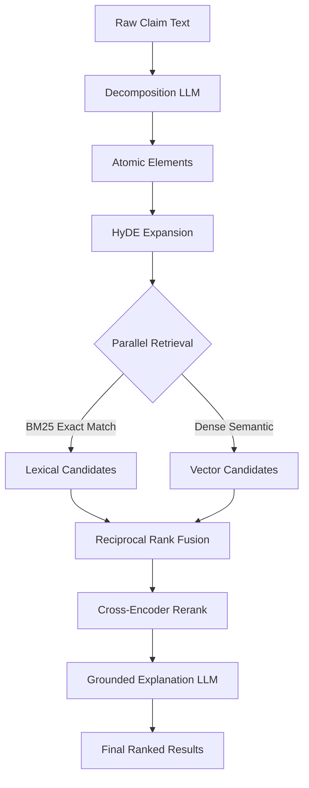

# Patent Prior-Art Search Engine

[](https://github.com/mishrasarthak08/Patent-Prior-Art-Search-Engine/actions/workflows/ci_full_gate.yml)
[](https://www.python.org/downloads/release/python-3120/)
[](https://nextjs.org/)
[](https://fastapi.tiangolo.com)

A production-grade, hybrid-retrieval, and explainable prior-art discovery system. This system decomposes raw patent claims into atomic technical limitations, performs parallel hybrid search across a bounded patent corpus, fuses the results, reranks them via a cross-encoder, and generates grounded AI explanations.

---

## 🚀 Core Objective
Built an AI-powered Patent Prior-Art Search Engine to assist legal professionals by automating the retrieval, ranking, and relevance analysis of complex patent claims against large document corpora.

## 🛠 Tech Stack & Tools
Architected the full stack using **Python, FastAPI, Next.js (React), Qdrant Vector Database, Cohere, LangGraph**, and the **Google Gemini Flash API**.

## 🧠 Key Implementation
Engineered a hybrid search pipeline (**BM25 keyword + dense vector retrieval**) orchestrated via LangGraph, integrating cross-encoder reranking and explainable AI to transparently map structural claim elements to prior-art snippets.

## ⚡ DevOps & Impact
Automated robust CI/CD pipelines via **GitHub Actions** featuring secret scanning (GitLeaks), strict static analysis (Ruff/Mypy), and smoke testing, alongside seamless full-stack deployments to **Vercel** and **Render** using Docker.

---

## Architecture Pipeline



## Repository Structure

```text
├── backend/            # FastAPI backend & LangGraph retrieval pipeline
│   ├── app/            # Main application code (routes, retrieval, schemas)
│   ├── Dockerfile      # Backend container definition
│   └── requirements.txt# Python dependencies
├── frontend/           # Next.js React UI
│   ├── src/app/        # Next.js App Router pages
│   └── tailwind.config # Tailwind styling configuration
├── scripts/            # Operational scripts
│   ├── ingestion/      # Scripts to build BM25 & Dense indexes
│   └── smoke_test.sh   # Automated smoke testing for CI
├── tests/              # Pytest suite
│   └── eval/           # Automated LLM-as-a-judge evaluation harness
├── docker-compose.yml  # Local development environment
└── .github/workflows/  # CI/CD pipelines
```

## Local Setup

### 1. Environment Configuration
Copy the sample environment file and add your API keys:
```bash
cp .env.example .env
# Edit .env to add GOOGLE_API_KEY and COHERE_API_KEY (optional)
```

### 2. Run with Docker Compose
The easiest way to run the entire stack locally (Backend + Qdrant + Frontend):
```bash
docker compose build
docker compose up -d
```
- **Frontend**: http://localhost:3000
- **Backend API**: http://localhost:8000
- **API Docs**: http://localhost:8000/docs
- **Qdrant Dashboard**: http://localhost:6333/dashboard

## Deployment

This repository is configured for automated deployments:
- **Frontend (Vercel)**: Automatically deployed from the `frontend/` directory.
- **Backend (Render)**: Automatically deployed using `render.yaml` and Docker.

---
*Disclaimer: This tool assists prior-art research and is NOT a substitute for a registered patent attorney or professional prior-art search firm.*
